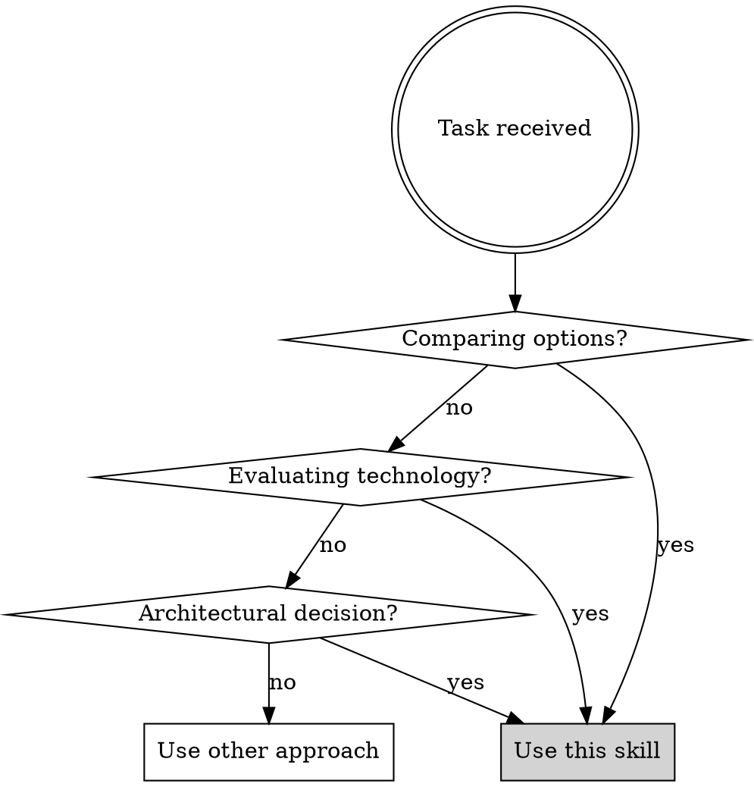

# Research Skill

## Overview

Systematic research that produces documented, reproducible findings. Research lives in `docs/research/` as persistent artifacts that inform future decisions.

**Core principle:** Research without documentation is wasted work. Research without codebase analysis produces unusable recommendations.

**Violating the letter of this process is violating the spirit.** No shortcuts.

## When to Use



**Use when:**
- Comparing database, framework, or library options
- Evaluating integration approaches
- Making build-vs-buy decisions
- Investigating unfamiliar technology before implementation
- Decision was "already made" but not documented (validate it)

**Don't use when:**
- Simple lookup questions (use web search directly)
- Debugging existing code

## The Research Workflow

**CRITICAL: Follow these steps IN ORDER. Do not skip steps.**

### Step 1: Clarifying Questions

Ask 2-4 targeted questions to understand scope and constraints.

**Required question areas:**
1. Scale/performance requirements
2. Current tech stack and integration constraints
3. Budget or licensing constraints
4. Timeline for implementation

**Skip this step ONLY if:** User's initial message explicitly answers ALL FOUR question areas above. "We need this quickly" is NOT a requirement—it's urgency. Document which questions were answered in your research doc.

### Step 2: Create Research Document

Create `docs/research/{topic-name}.md` with this header:

```markdown
# {Research Topic Title}

**Created:** {YYYY-MM-DD}
**Last Updated:** {YYYY-MM-DD}
**Status:** In Progress
```

**Naming convention:** Use kebab-case describing the decision (e.g., `rag-pipeline-database-options.md`, `auth-library-comparison.md`)

### Step 3: Document the Problem

Below the header, write a detailed problem description (minimum 150 words) covering:

- **Current state:** What exists today? What's working/not working?
- **Problem specifics:** What exactly needs to change and why?
- **Why now:** What triggered this research?
- **Constraints:** Budget, timeline, team expertise, compliance, etc.
- **Progress so far:** What's already been tried or considered?

**Minimum requirement:** 150+ words with all five sections above. This prevents scope creep and ensures future readers understand context.

### Step 4: Define Research Objective

Write a clear, specific research objective. Answer:

- What exactly are we researching?
- What questions must be answered?
- What search terms/topics will you investigate?

```markdown
## Research Objective

We are researching {X} to determine {Y}.

Key questions:
1. {Specific question 1}
2. {Specific question 2}
3. {Specific question 3}

Search areas:
- {Topic/keyword 1}
- {Topic/keyword 2}
```

### Step 5: Analyze the Codebase

**THIS STEP IS NON-NEGOTIABLE. DO NOT PROCEED TO STEP 6 UNTIL COMPLETE.**

Before researching external options, understand the existing system:

1. **Identify touchpoints:** What files/modules will be affected?
2. **Map data flow:** How does data move through the relevant parts?
3. **Document dependencies:** What does the affected code depend on?
4. **Understand patterns:** What conventions does the codebase follow?

**Completion criteria (ALL required):**
- [ ] 3+ affected files documented with specific paths
- [ ] Data flow traced through 4+ steps
- [ ] 3+ existing patterns identified
- [ ] 2+ integration constraints documented with reasoning

**Goal:** Understand the integration context better than the person who wrote the code.

```markdown
## Codebase Analysis

### Affected Components
- `path/to/file1.py:L45-L120`: {What it does, why it matters}
- `path/to/file2.py:L10-L50`: {What it does, why it matters}
- `path/to/file3.py`: {What it does, why it matters}

### Data Flow
1. {Step 1: Data enters at...}
2. {Step 2: Transforms via...}
3. {Step 3: Passes to...}
4. {Step 4: Outputs as...}

### Existing Patterns
- {Pattern 1}: {Where used, why}
- {Pattern 2}: {Where used, why}
- {Pattern 3}: {Where used, why}

### Integration Constraints
- {Constraint 1}: {Why this matters, evidence from code}
- {Constraint 2}: {Why this matters, evidence from code}
```

### Step 6: Define Acceptance Criteria

**Before researching, know what "done" looks like. DO NOT MODIFY CRITERIA AFTER RESEARCH BEGINS.**

Process:
1. Brainstorm 5-7 potential acceptance criteria
2. Assign probability each is actually useful (0-100%)
3. Critically evaluate: Is this measurable? Relevant? Achievable?
4. Re-rank based on evaluation
5. Select final 3-4 criteria (minimum 3)

**Each criterion MUST be:**
- Specific and measurable (not "good performance" but "latency < 100ms at 1000 QPS")
- Falsifiable (clear pass/fail test)
- Derived from codebase analysis (Step 5)

```markdown
## Acceptance Criteria

**Brainstormed (document all 5-7):**
1. {Criterion}: {probability}% - {why considered}
2. {Criterion}: {probability}% - {why considered}
...

**Selected (3-4, with pass/fail definition):**
- [ ] {Criterion 1} — Pass if: {specific test}
- [ ] {Criterion 2} — Pass if: {specific test}
- [ ] {Criterion 3} — Pass if: {specific test}
```

**Good criteria examples:**
- "At least 3 viable options identified with documented pros/cons"
- "Performance benchmarks compared for our expected load (X requests/sec)"
- "Integration complexity assessed: estimated days to implement each option"
- "Licensing reviewed: all options compatible with our license"

### Step 7: Conduct Research

**Minimum requirements:**
- Evaluate at least 3 viable options (not just the ones user mentioned)
- Use at least 5 distinct searches
- Cross-reference at least 3 different sources
- Document every search (query, source, what you found)

Use available research tools:

| Tool | Best For |
|------|----------|
| `mcp__tavily__tavily_search` | General web search, recent information |
| `WebSearch` | Current events, documentation |
| `mcp__context7__query-docs` | Library-specific documentation |
| `mcp__langchain-docs__SearchDocsByLangChain` | LangChain/LangGraph docs |
| `mcp__OpenAI_Developer_Docs__*` | OpenAI API documentation |
| `WebFetch` | Reading specific URLs |

**Research strategy:**
1. Start broad, then narrow
2. Cross-reference multiple sources
3. Look for real-world usage examples
4. Check GitHub issues/discussions for pain points
5. Find benchmark comparisons where available

**Document each search:**
```markdown
### Research Log

#### Search 1: {date}
- **Query:** {what you searched}
- **Tool:** {which tool}
- **Found:** {key findings}
- **Changed my thinking:** {how this affected your view}
```

### Step 8: Iterate and Update

**Continuously update the research document as you learn.**

After each research session:
1. Add findings to document
2. Check against acceptance criteria (Step 6)
3. If criteria not met, continue researching
4. If blocked, update document with what's missing

```markdown
## Findings

### Option 1: {Name}
**Summary:** {1-2 sentences}
**Pros:**
- {Pro 1}
- {Pro 2}

**Cons:**
- {Con 1}
- {Con 2}

**Fit with our codebase:** {Assessment based on Step 5 analysis}

### Option 2: {Name}
{Same structure}
```

### Step 9: Complete and Recommend

**DO NOT write recommendation until ALL acceptance criteria are marked PASS with evidence.**

When acceptance criteria are met:

1. Write executive summary at top of document
2. Make a clear recommendation with rationale
3. Update status to "Complete"
4. Update "Last Updated" date

**Recommendation requirements:**
- Reference 3+ specific findings from your research (with sources/dates)
- Explain fit against EACH acceptance criterion
- Explain why EACH rejected option was rejected
- Ground recommendation in codebase analysis (Step 5)

```markdown
## Recommendation

**Recommended approach:** {Option name}

**Rationale:**
- Meets criterion 1 because: {evidence from research}
- Meets criterion 2 because: {evidence from research}
- Meets criterion 3 because: {evidence from research}
- Fits codebase because: {reference Step 5 analysis}

**Why not {Option 2}:** {Specific reason with evidence}
**Why not {Option 3}:** {Specific reason with evidence}

**Next steps:**
1. {Concrete action 1}
2. {Concrete action 2}
```

## Red Flags - STOP and Reconsider

If you think any of these, you're rationalizing. Stop and follow the process:

| Thought | Reality |
|---------|---------|
| "I already know the answer" | Prior knowledge is hypothesis, not conclusion. Validate it. |
| "User already researched this" | Their research isn't documented. Do your own. |
| "Codebase analysis takes too long" | Recommendations without context are worthless. Do it. |
| "I'll document later" | You won't. Document as you go. |
| "User wants quick answer" | Quick bad answers waste more time than thorough research. |
| "We don't have time for this" | Document the time constraint, then follow the process anyway. |
| "Acceptance criteria are obvious" | Write them down. All 5-7 brainstormed, then select 3-4. |
| "One source is enough" | Cross-reference 3+ sources minimum. Single sources have blind spots. |
| "These two options are well-known" | Evaluate at least 3 options. "Well-known" doesn't mean right for YOUR codebase. |
| "The decision is already made" | Then use this process to validate and document it. |
| "This is overkill for a simple decision" | Simple decisions become complex. Document now. |

## Common Mistakes

| Mistake | Fix |
|---------|-----|
| Research without documentation | Always create the research doc FIRST |
| Skip codebase analysis | Integration context determines viability |
| Vague acceptance criteria | Make them specific and measurable |
| Stop at first decent option | Compare at least 3 options |
| Ignore existing patterns | Recommendations must fit codebase conventions |
| No recommendation | Research must conclude with clear guidance |

## Checklist (Use TodoWrite)

**You MUST use TodoWrite to create a todo for EACH item. Do not proceed to next step until current step is marked complete.**

- [ ] Step 1: Clarifying questions asked (or all 4 areas answered in initial request)
- [ ] Step 2: Research doc created in `docs/research/` with header
- [ ] Step 3: Problem documented (150+ words, all 5 sections)
- [ ] Step 4: Research objective defined with specific questions
- [ ] Step 5: Codebase analysis complete (3+ files, 4+ flow steps, 3+ patterns, 2+ constraints)
- [ ] Step 6: Acceptance criteria defined (5-7 brainstormed, 3-4 selected with pass/fail tests)
- [ ] Step 7: Research conducted (3+ options, 5+ searches, 3+ sources, all logged)
- [ ] Step 8: All acceptance criteria verified as PASS with evidence
- [ ] Step 9: Recommendation written (references findings, explains rejections)
- [ ] Status updated to Complete

**Research is NOT complete until ALL items above are checked with documented evidence.**
